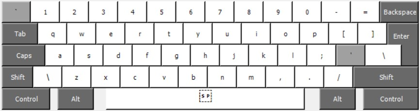
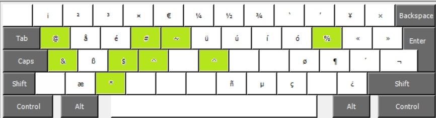

# QWERTY Programmer Layout
This is an experimental qwerty layout nice for programming and touch typing, using the 'alt gr' key for some symbols and having symbols activated by default.

## Layer

### Default Layer

### Shift Layer

### Alt Gr Layer

